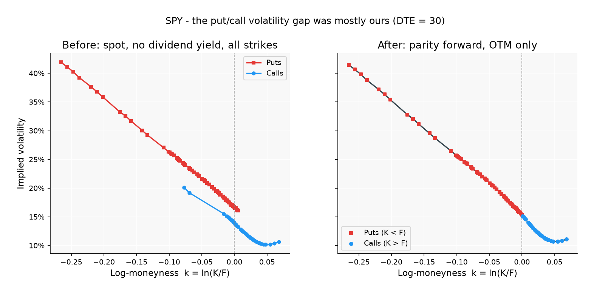
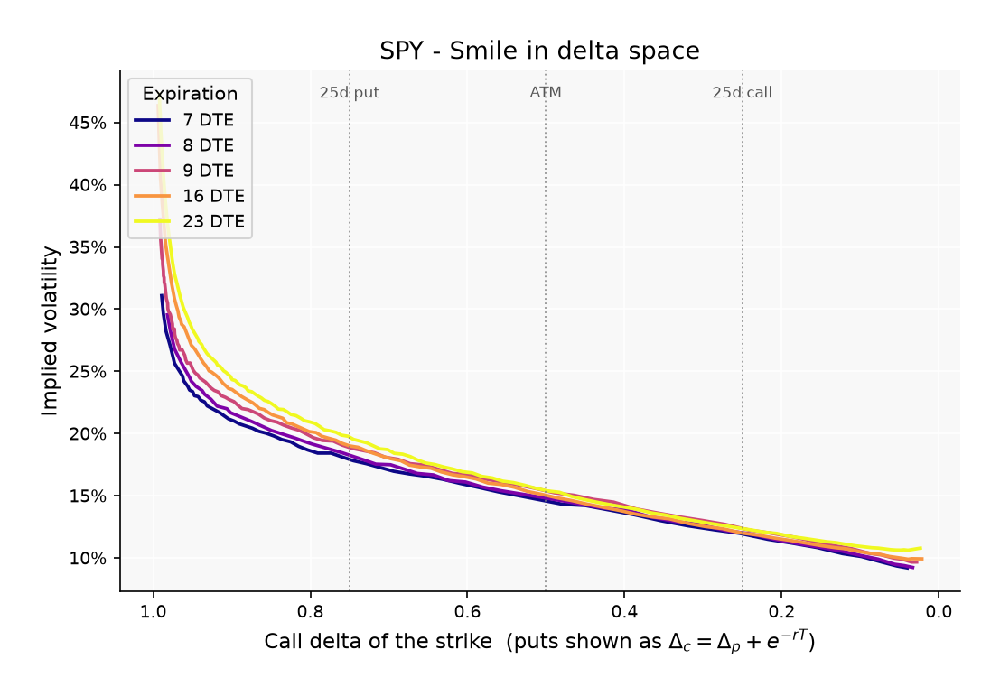
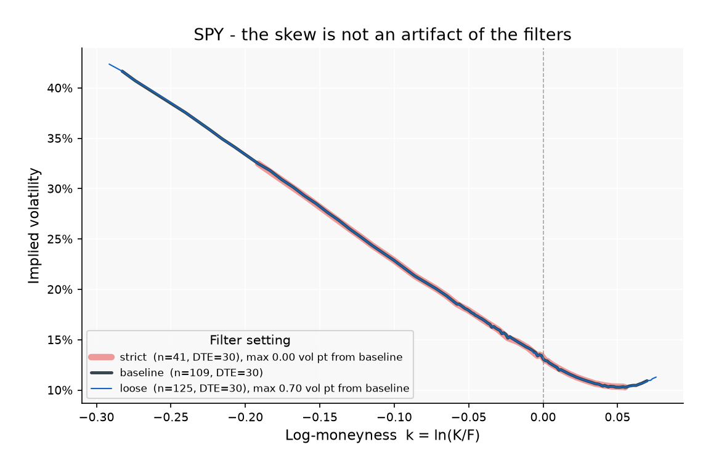

# Options Volatility Surface Analyzer

Builds the implied volatility surface of SPY options from the option chain, and
checks it against no-arbitrage rather than against how plausible the plot looks.

## The first version had a bug, and the bug turned out to be the interesting part

The first surface I built showed same-strike puts near 30 vol and calls near 14.
That is not a market observation. Put-call parity says a European call and put at
the same strike and expiry are tied together by

```
C - P = e^(-rT) (F - K)
```

so if both are priced off the same forward they must return the *same* implied
volatility. Two contracts differing by 15 vol points at one strike are not an
opportunity, they are an error by whoever computed them. It was mine, and there
were two causes.

**No dividend yield, so the wrong forward.** The pricer used spot directly, which
is the assumption `q = 0`. SPY yields about 1.1%, so the model's effective forward
sat above the real one. That biases call IV down and put IV up: manufactured skew,
pointing the same way as real skew, which is exactly why it looked believable.

**Comparing in-the-money puts against out-of-the-money calls.** The smile plot
overlaid every call and every put across the whole strike range. A deep ITM put
and an OTM call at the same strike are not two observations of one volatility.
They are one strike quoted twice, once on the wide side of the book.

The fix was to stop guessing the forward and read it off the market, per expiry,
from parity itself, at the strike where `|C - P|` is smallest:

```
F = K + e^(rT) (C - P)
```

and then build the surface from out-of-the-money contracts only: puts below the
forward, calls above it. One volatility per strike by construction, always from
the liquid side, and largely free of the American early-exercise premium, which
sits mostly in the in-the-money leg.



Same snapshot, same contracts, same day count, only the forward changed: the mean
same-strike gap goes from **+2.50 vol points to −0.08** across 199 matched
strikes.

## How much of it was actually the dividend

Worth being precise, because "I forgot the dividend yield" is the wrong lesson to
take from it.

The 30-versus-14 headline was mostly **not** a parity violation at all. It
compared an average over deep in-the-money puts against an average over
near-the-money calls: two different regions of moneyness, so most of the
difference was a composition artifact. At *matched* strikes the gap was 2.50 vol
points, not 15.

So the error split into a real but modest pricing bug worth a couple of vol
points, and a much larger presentation mistake from averaging incomparable
things. Both needed fixing and only one of them was arithmetic.

Reading the forward off parity gives one genuine market observable: the **carry**,
`r − q` = **0.0246**. Note what that is and is not. Parity pins the forward, and
the forward pins the difference between the rate and the yield, but not either one
separately: splitting the carry requires bringing in `r` or `q` from outside. So
the fact that this implies `q` = 1.14% at r = 3.6%, close to SPY's actual trailing
yield, is **not** an independent confirmation — I set `r` to 3.6% knowing roughly
what SPY yields. Quoting it as validation would be circular.

What the forward can be checked against, without that circularity, is its own
consistency:

- A single carry rate reproduces every expiry to within **0.0025 in logs**, so the
  curve really is close to the one-parameter object the no-arbitrage argument says
  it should be.
- The forward read off one strike matches an independent least-squares fit across
  *all* strikes at that expiry to within **0.03%**.
- Parity then holds out of sample at the strikes that were not used to set it
  (below).

What none of this pins down is `r` itself. Re-deriving the forward and re-running
the out-of-sample parity test at rates from 2% to 6% moves the median ATM residual
only from $0.067 to $0.078, against a median spread of $0.180: it passes at every
one of them, and the fitted carry barely moves either (0.0248 to 0.0244). So the
change from 5% to 3.6% is not something the data forced. It is an assumption,
picked because 3.6% is a more plausible short rate than 5% once the market has
told you that `r − q` is 2.46% and SPY yields about 1.1%. The honest version is
that this snapshot cannot identify `r`, which is the same reason the discount
factor cannot be fitted from parity across strikes, and it is worth knowing that
the choice does not matter much rather than assuming it does.

## What the surface actually says

Out-of-the-money puts trade above out-of-the-money calls at every maturity: the
25-delta risk reversal runs **5.8 to 9.6 vol points**, puts over calls. That is a
crash-risk premium, not a mispricing. Selling it is short gamma, short jump risk,
and short the correlation between falling spot and rising volatility. It earns a
premium most of the time and loses badly in the tail, which is what being paid to
write insurance looks like.

The skew flattens with maturity, and two measurements that are easy to conflate
behave differently:

| | 7 DTE | 324 DTE |
|---|---|---|
| ATM skew slope, dσ/dk | −1.811 | −0.386 |
| 25-delta risk reversal | 5.83 vol pts | 7.71 vol pts |
| slope × √T | −0.255 | −0.364 |

The **slope** flattens by a factor of 4.7. The **risk reversal** does not, and
reporting it as though it did would be wrong. The 25-delta strike itself moves
further out like σ√T, so a decaying slope across a widening strike range roughly
cancels. `slope × √T` stays inside [−0.367, −0.255] over a 46-fold range of
maturity, which is the 1/√T decay measured rather than asserted.

| Surface (OTM only) | Smile in delta space |
|---|---|
|  |  |

| Put skew by expiry | ATM term structure |
|---|---|
|  |  |

## Method

- Full SPY chain from Yahoo Finance. A live fetch writes the unfiltered chain to
  `data/raw/` before anything is discarded.
- Forward per expiry from put-call parity, computed **before** the liquidity
  filters. Parity needs the near-ATM call and put together, and a spread filter
  will cheerfully delete one leg of that pair. On this snapshot the original
  absolute-spread filter destroyed the ATM pair at 6 of 31 expiries. Computed
  upstream the forward is a property of the market; computed downstream it becomes
  a property of the filter settings.
- 25 of 31 expiries yield a parity forward directly. The remaining 6 have no
  strike quoted on both sides and fall back to the fitted carry curve, labelled
  as such.
- Black-76 inverted for volatility: Newton on analytic vega, with Brent as the
  fallback.
- Maturities 7 to 365 days. Below a week the day count dominates; past a year the
  quotes are thin and stale.

### Filters

| filter | value | why |
|---|---|---|
| relative spread | ≤ 10% of mid | An absolute cap is backwards. At a median relative spread of 0.6%, a $0.50 cap keeps a penny option quoted 0.01/0.06 (600% wide) and discards an ATM contract quoted 21.85/21.95. |
| absolute spread floor | ≤ $0.01 exempt | One tick, and only one tick. A contract quoted 0.05/0.06 cannot be tighter and should not be punished for it; 0.01/0.06 is five ticks wide and is what the relative test exists to remove. |
| minimum mid | ≥ $0.10 | Below a dime vega has collapsed, so the mid rounds to the same price across a wide range of σ. On SPY this removes only the sub-2-delta tail. |
| open interest | ≥ 100 | Open interest is a stock and is time-of-day independent. Volume is a flow and reads near zero early in the session. |
| maturity | 7–365 days | Day-count error at the front, staleness at the back. |

Filters partly shape any result like this, so the same 30-day skew is plotted
under three settings, over an unfiltered chain so the sweep can genuinely loosen
as well as tighten (955, 1,598 and 2,133 contracts respectively). Tightening to
5% spreads and 500 open interest moves the curve by 0.00 vol points; loosening to
20% and 10 moves it by 0.70. The shape is not the filters.



### Solving for volatility

Newton with analytic vega is the fast path and solves all 1,588 contracts here;
Brent is the fallback. Brent cannot diverge, because Black-76 is monotonic in σ
so a sign change over the bracket guarantees a root, but it is slower. Newton is
faster and misbehaves where vega is near zero.

Getting the fallback rate down was itself a bug fix worth recording. Seeded with
the Brenner-Subrahmanyam approximation `σ ≈ √(2π/T)·price/F`, which is an
at-the-money formula, Newton bailed on 57% of contracts: out of the money the
price is small, so the seed lands at half a vol point where the true answer is
27, and vega there is zero to machine precision. Flooring the seed at the
volatility that makes total variance of order `2|k|` starts it where vega is
largest, and the fallback rate went to zero on this chain. Brent still fires in
the vega-dead regime, which is reachable synthetically (73 of 3,000 random
contracts in the solver check), and the two agree to 2.1e-08 wherever vega
carries any signal at all.

## Validation

Every number, with the command that regenerates it, in
[docs/VALIDATION.md](docs/VALIDATION.md) — written by `python src/validation.py`
rather than typed.

| check | result |
|---|---|
| Textbook price (Hull: S=K=100, T=1, r=5%, σ=20%) | 10.4506 call / 5.5735 put, to 2.6e-05 |
| Put-call parity holds identically in the pricer | max residual 6.3e-13 over 5,000 random inputs |
| Newton agrees with Brent | 2.1e-08 where vega carries signal |
| Parity holds on the cleaned output, at the money | median residual $0.074 against a median combined spread of $0.180 |
| Our IV against Yahoo's, an independent implementation | correlation 0.9942, MAE 0.99 vol points |
| Total variance non-decreasing in T at fixed k | 0 violations of 222 grid transitions |
| SVI slices free of butterfly arbitrage | 21 of 21, median fit error 0.66 vol points |

Two of those deserve a note.

**The parity check is not circular, though it is close enough to need the
explanation.** The forward is read off parity at one strike per expiry, so the
residual at *that* strike is zero by construction. Every other strike is out of
sample: one number per expiry is fitted, and parity then either holds across the
rest of the chain or it does not. It holds at the money to well inside the
bid-ask spread, and degrades monotonically as strikes move in the money —
$0.07 at |k| ≤ 0.02, $0.34 by |k| ≤ 0.05, $0.49 by |k| ≤ 0.10. That profile is
the American early-exercise premium, which a European formula cannot see and
which is largest exactly where the residual is worst.

**Agreeing perfectly with Yahoo would be a bad sign, not a good one.** Yahoo
prices off spot with no dividend, which is the bug at the top of this file. The
signal is a high correlation together with a *smaller* error on the OTM subset
(0.91 vol points) than on the full set (0.99), where both implementations are on
their best behaviour.

## SVI

`src/svi.py` fits raw SVI per expiry, `w(k) = a + b[ρ(k−m) + √((k−m)² + σ²)]`,
weighted by vega so the fit tracks the money rather than the noisy wings. The
point is not a smoother picture. Cubic interpolation of scattered implied vols
guarantees nothing about arbitrage; SVI is a shape whose implied density can be
tested, so it is tested, with Gatheral and Jacquier's `g(k) ≥ 0`.

All 21 slices pass, at a median fit error of 0.66 vol points. Fitting each
maturity independently does **not** produce a globally arbitrage-free surface,
because nothing constrains the slices against each other, and the calendar check
is what measures the remainder: within the traded strike range there are no
violations, while extrapolating the fitted slices past the strikes the market
actually quotes introduces 8 of 260 — which is the argument for not doing that.

Bounding the fit matters more than it looks. Left loose, the long-dated slices ran
off along a flat ridge where `b` hit its bound, `a` went negative and `m` walked
outside the traded strikes: the shape still tracked the data but the parameters
stopped meaning anything. Tying `m` to the observed strike range fixes it, since
`m` is where the variance minimum sits and that has to be somewhere the market
quotes.

## Running it

Python 3.10+.

```bash
git clone https://github.com/plattimer16/Volatility-Surface-Analyzer.git
cd Volatility-Surface-Analyzer
pip install -r requirements.txt
```

```bash
python src/data_collection.py    # fetch, save the raw chain, filter
python src/iv_calculation.py     # solve for implied volatility
python src/validation.py         # the checks above; regenerates docs/VALIDATION.md
python src/visualization.py      # the figures
```

A reference snapshot is committed as the pipeline's input, so every number above
reproduces from a clone with no network access. Run it first, then steps 2 to 4:

```bash
python src/data_collection.py --from-raw data/raw/spy_chain_reference.csv
```

`src/svi.py` is a module rather than a pipeline step. Run it directly to fit the
slices and print the parameters.

## Limitations

- One snapshot: 2026-02-25, 10:43 ET, spot 690.60, 1,588 contracts across 21
  expiries after filtering. This is a photograph of a surface, not a time series.
  A second, unfiltered chain is committed for the filter sweep only.
- Yahoo Finance quotes, and **spot is captured once and reused across the whole
  chain**, so the underlying and the option quotes are not synchronous. Taking
  the forward from parity per expiry removes most of the damage that would
  otherwise do, since the forward no longer depends on the recorded spot.
- **Fetch mid-session.** Yahoo populates bid/ask progressively after the open, and
  before then it returns `bid = ask = 0` while still filling in `lastPrice`,
  volume and open interest. Measured on one morning: one minute after the open,
  0 of 9,837 contracts had a two-sided quote, including front-month strikes with
  six-figure volume; fifteen minutes later, 4,028 did. The pipeline requires a
  live two-sided quote and discards the rest, which is correct but means an early
  fetch quietly yields almost nothing. Spreads also stay wide for the first part
  of the session, so a snapshot an hour in is materially cleaner.
- SPY options are American, priced here with a European model. The
  early-exercise premium is visible in the parity residuals and is a reason for
  building the surface from the out-of-the-money side.
- Constant `r`, no term structure. The forward comes from the market and does not
  depend on it; only the discount factor does. Backing `r` out of parity as well
  does not work: fitting `C − P = D(F − K)` across strikes gives a stable `F` but
  a wildly unstable `D`, because at short maturities `F − K` spans too small a
  range to pin the slope.
- Dividends are treated as a continuous yield. SPY pays four discrete dividends a
  year, so the forward really steps on ex-dates.
- The filter-robustness sweep uses a second, unfiltered chain
  (`data/raw/spy_chain_unfiltered.csv`, 2026-09-02) rather than the reference,
  because the reference has already been through one pass of filtering and a
  sweep needs to be able to loosen. Different snapshot, so read that figure as a
  statement about filter sensitivity, not about the same day's surface.
- SVI is fitted slice by slice, not globally.

## References

- Black, F. & Scholes, M. (1973). *The Pricing of Options and Corporate
  Liabilities.* Journal of Political Economy.
- Black, F. (1976). *The Pricing of Commodity Contracts.* Journal of Financial
  Economics. The forward form used here.
- Natenberg, S. *Option Volatility and Pricing*, 2nd ed. Ch 6 (Volatility),
  Ch 15 (Option Arbitrage, for put-call parity), Ch 18 (The Black-Scholes
  Model), Ch 24 (Volatility Skews).
- Gatheral, J. (2006). *The Volatility Surface: A Practitioner's Guide.* Wiley.
  Ch 3 for the surface and the term structure of skew.
- Gatheral, J. & Jacquier, A. (2014). *Arbitrage-free SVI volatility surfaces.*
  Quantitative Finance. The `g(k)` butterfly condition.
