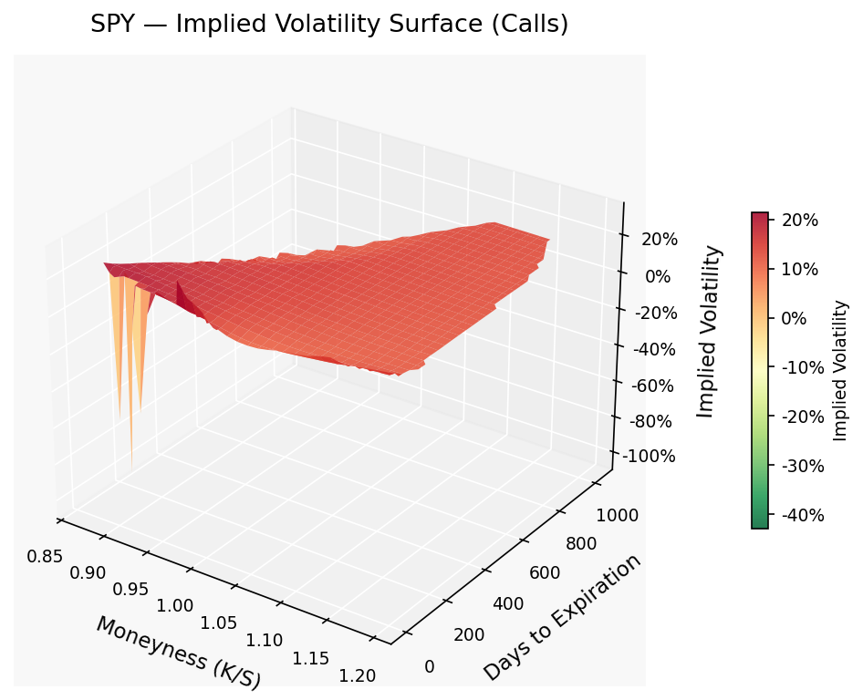
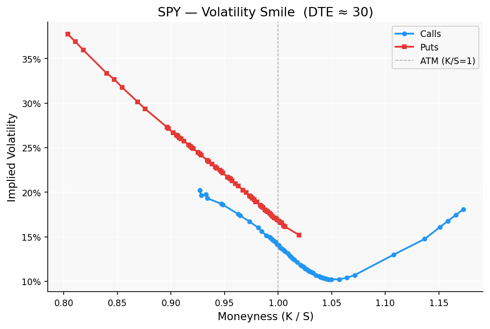
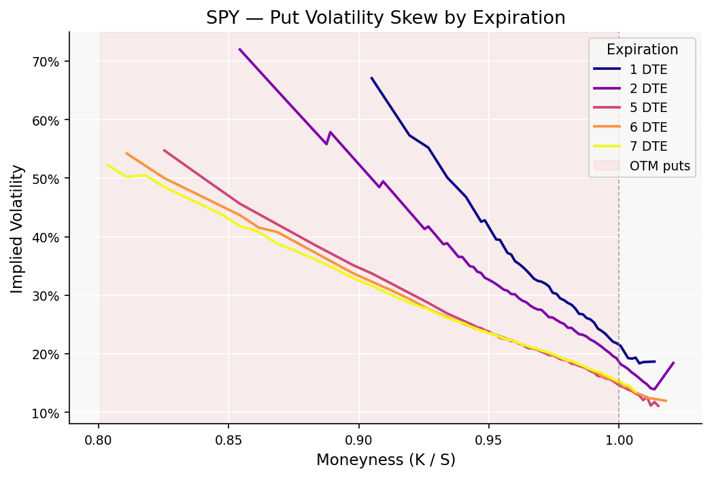
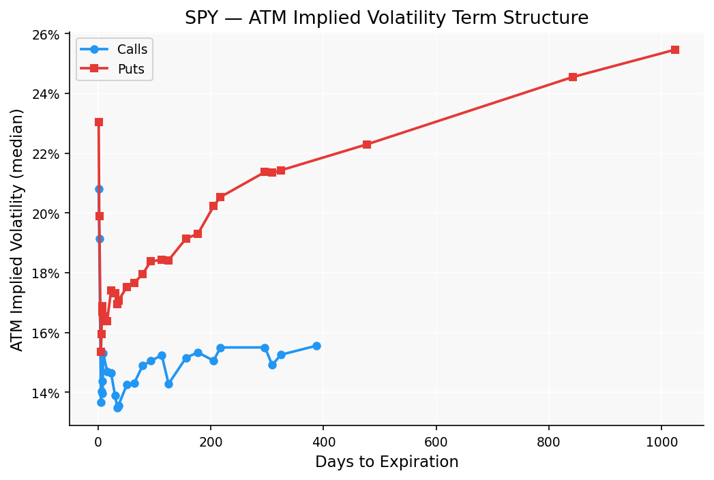

# Options Volatility Surface Analyzer

A Python tool to download, process, and visualize the implied volatility surface of equity options. Built to explore how options markets price risk — specifically the volatility skew that causes OTM puts to consistently trade at higher implied volatilities than calls.

## Key Findings (SPY, Feb 2026)

| Observation | Detail |
|---|---|
| **Put skew exists** | OTM puts carry ~15–35% IV vs ~10–15% for ATM calls at the same DTE |
| **Front-month skew is steepest** | 3–7 DTE puts show the sharpest slope — the crash premium is most expensive when time is short |
| **Term structure is upward-sloping for puts** | ATM put IV rises from ~15% at 3 DTE to ~25% at 850 DTE, reflecting long-horizon uncertainty |
| **Calls are much flatter** | ATM call IV holds roughly 12–15% across all expirations |
| **99% IV solve rate** | Brent's method converged for 2,686 of 2,712 contracts |

## Sample Output

| 3-D Volatility Surface | Volatility Smile (28 DTE) |
|---|---|
|  |  |

| Put Skew by Expiration | ATM Term Structure |
|---|---|
|  |  |

## Project Structure

```
├── src/
│   ├── data_collection.py   # Download & clean options chain from Yahoo Finance
│   ├── iv_calculation.py    # Black-Scholes pricing + Brent's method IV solver
│   └── visualization.py     # 4 publication-quality matplotlib plots
├── data/
│   ├── processed/           # Generated CSVs (git-ignored; re-run to populate)
│   └── figures/             # Saved plots (committed for GitHub preview)
├── requirements.txt
└── README.md
```

## Installation

**Requirements:** Python 3.10+

```bash
git clone https://github.com/<your-username>/Volatility-Surface-Analyzer.git
cd Volatility-Surface-Analyzer
pip install -r requirements.txt
```

## Usage

Run the three scripts in order. Each one reads the output of the previous step.

### Step 1 — Download options data

```bash
python src/data_collection.py
```

Downloads the full SPY options chain from Yahoo Finance, filters out illiquid contracts (bid-ask spread > $0.50, volume < 10), and saves a cleaned CSV to `data/processed/`.

**Output:** `data/processed/spy_options_YYYYMMDD_HHMMSS.csv`

To fetch a different ticker, change the `TICKER` constant at the top of [src/data_collection.py](src/data_collection.py).

---

### Step 2 — Calculate implied volatility

```bash
python src/iv_calculation.py
```

Reads the most recent CSV from `data/processed/`, solves for Black-Scholes implied volatility using the mid-price `(bid + ask) / 2` for each contract, and saves an enriched CSV with an `implied_volatility_bs` column.

**Output:** `data/processed/spy_options_YYYYMMDD_HHMMSS_with_iv.csv`

---

### Step 3 — Generate plots

```bash
python src/visualization.py
```

Reads the most recent `_with_iv.csv` (or falls back to the Yahoo Finance `impliedVolatility` column) and generates all four plots.

**Output:** four PNGs in `data/figures/`

---

## Technical Details

### Black-Scholes model

For a European call and put respectively:

```
C = S·N(d₁) − K·e^(−rT)·N(d₂)
P = K·e^(−rT)·N(−d₂) − S·N(−d₁)

where  d₁ = [ln(S/K) + (r + σ²/2)·T] / (σ·√T)
       d₂ = d₁ − σ·√T
```

### IV solver

`scipy.optimize.brentq` is used to find the σ that makes the BS price equal the observed mid-price. Brent's method is guaranteed to converge when the objective function changes sign over the search interval `[1e-6, 10.0]`. Contracts where no sign change exists (e.g. deep ITM options priced at intrinsic value) return `np.nan`.

### Data filters

| Filter | Value | Reason |
|---|---|---|
| Max bid-ask spread | $0.50 | Wide spreads mean the mid-price is far from fair value |
| Min volume | 10 contracts | Thin volume → stale or crossed quotes |
| Min DTE | 1 day | Expired contracts have undefined IV |
| Moneyness window | 0.80 – 1.20 | Deep ITM/OTM contracts are very illiquid and noisy |

### Constants

| Constant | Value |
|---|---|
| Risk-free rate (`r`) | 5% (approximate 1-year T-bill) |
| ATM band | ±2% moneyness |

## Why Volatility Skew Exists

The persistent put premium has three reinforcing causes:

1. **Leverage effect** — falling prices increase firm leverage, raising equity volatility, so puts become more correlated with volatility spikes than calls.
2. **Crash insurance demand** — institutions buy OTM puts as portfolio hedges, bidding up their prices regardless of Black-Scholes fair value.
3. **Supply/demand imbalance** — fewer natural sellers of OTM puts exist, so market makers demand a premium to absorb the inventory risk.

## References

- Black, F. & Scholes, M. (1973). *The Pricing of Options and Corporate Liabilities.* Journal of Political Economy.
- Natenberg, S. *Option Volatility and Pricing* — Chapter 7–8 (IV) and Chapter 18 (skew).
- Gatheral, J. (2006). *The Volatility Surface: A Practitioner's Guide.* Wiley Finance.
